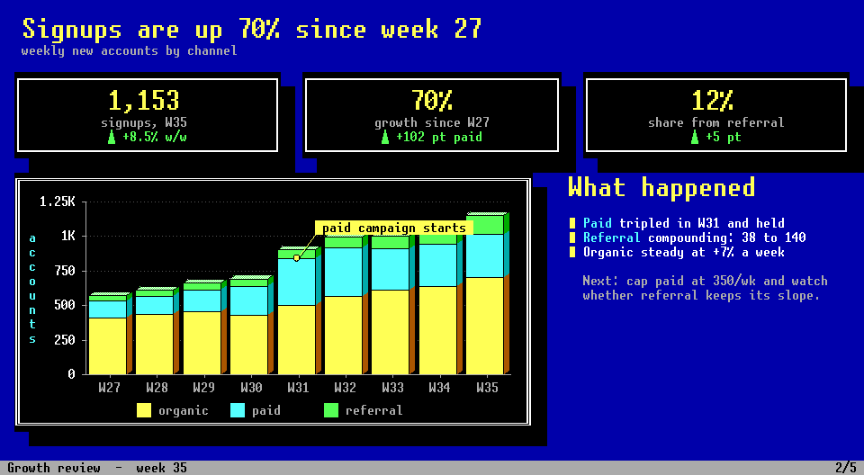
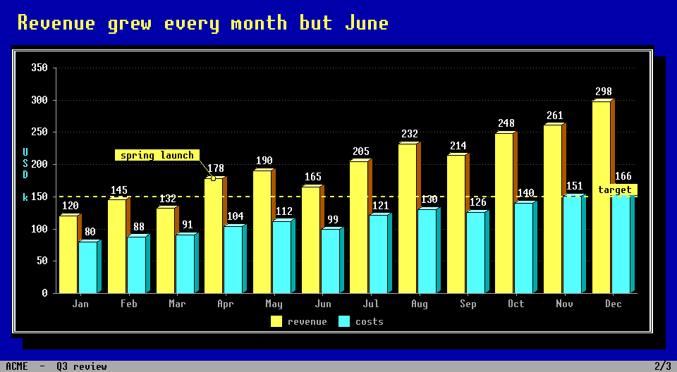
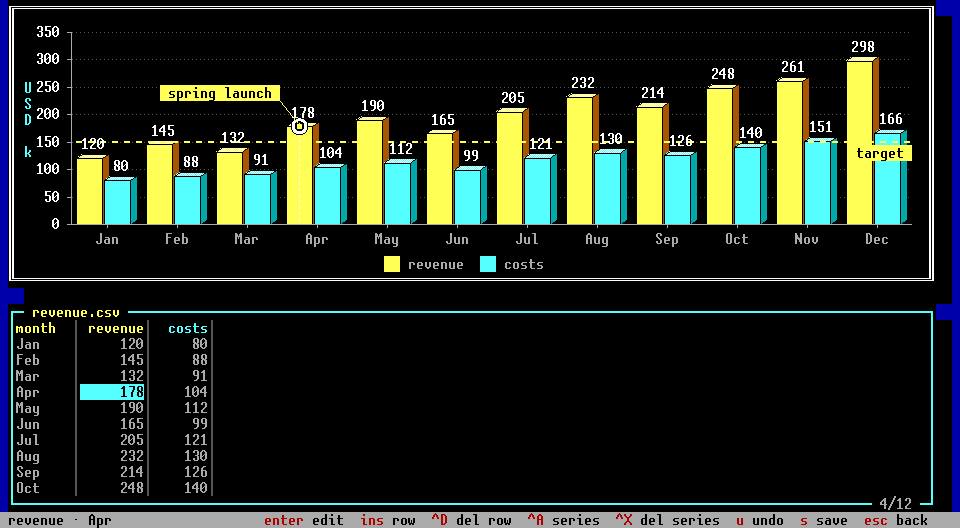
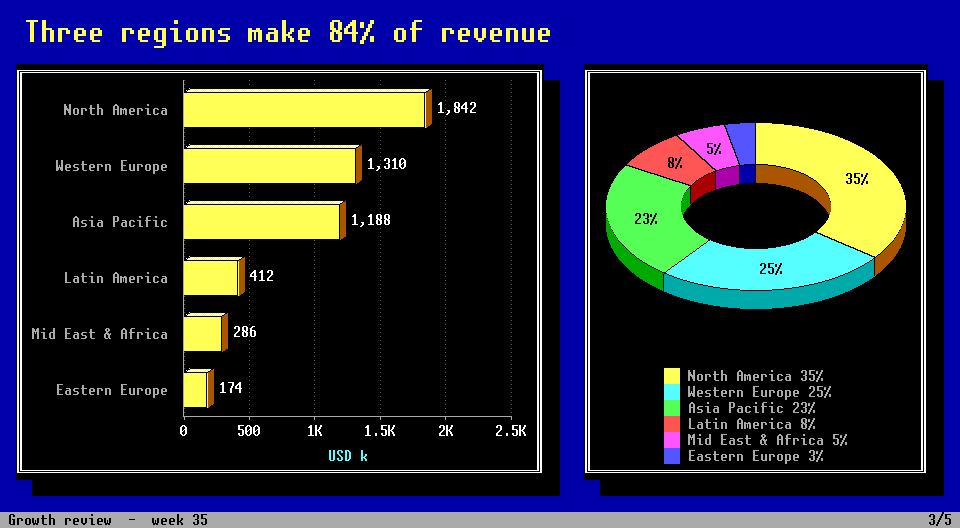

# charts-dot-exe

Business graphics for the Linux console, the way a VGA card drew them: 16
colours, hard pixels, dithered shading, a bitmap font, double-line frames and
drop shadows. An agent writes the deck; you page through it with the arrow
keys, fix a number in the built-in sheet, pin a note on a bar.



One binary, no dependencies, no X, no Wayland. On a bare console it draws real
pixels through `/dev/fb0`. Inside kitty, ghostty, wezterm or foot it sends the
same picture through their graphics protocols. Anywhere else — ssh, tmux, a
serial line — it falls back to half blocks, and `--ascii` below that.

## Build

```sh
make                          # ./charts   (C++17 compiler and make, nothing else)
make test                     # 500-odd checks: CLI, fuzz, and the presenter on a pty
make install PREFIX=~/.local  # or the default /usr/local
```

The framebuffer needs you in the `video` group, which a desktop user normally is.

## Use

```sh
charts deck.json                 # present: left/right to page, ? for every key
charts -i sales.csv costs.csv    # data files straight into the presenter, a slide each
charts sales.csv -t pie3d        # or just print one chart into the shell
cat data.csv | charts -t line

charts deck.json --check         # every problem, addressed by JSON path
charts deck.json --png-dir out/  # render without a screen
```

`charts` is a tool for agents. `charts -h` is the complete manual, written for
the agent building the deck (the skill in `skill/` is generated from it). The
human runs a launcher: `charts deck.json --launcher q3` writes `~/.local/bin/q3`,
which finds a terminal if it needs one and lets `charts` pick framebuffer,
kitty, sixel or cells from wherever it lands. Everything about how a deck looks
— theme colours, palettes, per-series colours, display scale — is in the deck
file.

## Decks

A deck is one JSON file. Slides hold charts, text, big numbers, flow diagrams
and free shapes, laid out automatically or on a 12×12 grid. Data is a
CSV/TSV/JSON file beside the deck, or inline.

```json
{
  "title": "Q3 review",
  "slides": [
    {"title": "Q3 review", "subtitle": "Revenue, costs and what comes next"},
    {
      "title": "Revenue grew every month but June",
      "type": "bar", "values": true, "data": "revenue.csv",
      "annotations": [
        {"at": "Apr", "series": "revenue", "text": "spring launch"},
        {"y": 150, "text": "target"}
      ]
    }
  ]
}
```



The format is in [`docs/DECK.md`](docs/DECK.md). It is built for an agent to
write: mistakes come back with their JSON path and a suggestion
(`slides[1].type: unknown chart type "barr" -- did you mean "bar"?`), and
`--png` lets the agent look at what it made. [`docs/AGENT.md`](docs/AGENT.md)
is the working loop; `skill/` is the same thing packaged as an agent skill.

The presenter watches the deck and its data files. When the agent rewrites
them, the screen follows.

## In the presenter

```
← → space pgup pgdn   slides             o   overview        12 enter   go to slide 12
tab                   focus a block      n   speaker notes   y          next theme
e   edit: the data sheet of a chart, or a text block
a   annotate: callouts on points, target lines, marks
t p v l g d x         chart type, palette, values, legend, grid, 3-D depth, explode
i c N E X             add text, add a chart, new slide, edit title, delete block
s   save              r   reload         q   quit
```



`e` on a chart opens its numbers. Type over a cell, `ins` for a row, `^A` for a
series, `u` to undo; the chart above redraws as you go. `s` writes a CSV back
to its file (comment and `#chart` lines kept) and inline data back into the
deck. A file the loader had to simplify — a text column dropped, a transposed
read — is never overwritten; the sheet says so.

## Chart types

`bar` `stacked` `hbar` `dumbbell` `line` `area` `pie` `pie3d` `donut`
`scatter` `hist` `table`. Bars, pies and donuts are extruded by default;
`depth: 0` is flat. Bars on an axis that does not start at zero are drawn torn.
`errors` puts whiskers on bars, lines and points from min/max or ± columns.

Beside the charts: `flow` blocks (name the steps and the arrows, the layout is
done for you) and `shapes` blocks (rectangles, ellipses, polygons, arrows and
labels on a 12×12 grid, solid, dithered or extruded).



Palettes: `dos` `ega` `cga` `ice` `fire` `green` `amber` `mono`. Themes: `dos`
(blue desktop, black windows), `black` (no backdrop; the default when printing
into a shell), `light`. Without colour, or on `mono`, series are told apart by
dither instead.

## Documentation

- [`docs/DECK.md`](docs/DECK.md) — the deck format
- [`docs/INPUT.md`](docs/INPUT.md) — every accepted CSV and JSON data shape
- [`docs/AGENT.md`](docs/AGENT.md) — driving charts from an agent or a script
- [`docs/charts.1`](docs/charts.1) — man page

## Layout

```
src/gfx.*       16-colour surfaces, dither inks, the bitmap font, indexed images
src/png.cpp     PNG writer with its own deflate
src/scene.*     one screenful: text cells + pixel surfaces -> cells or an image
src/charts.cpp  every chart renderer, annotations, error bars
src/diagram.*   shapes and flow diagrams
src/deck.*      deck model, checking, saving        src/slide.cpp   slide layout and drawing
src/display.*   framebuffer, kitty, sixel, cells    src/tui.cpp     the presenter
src/data.* json.* spec.*   loaders, write-back, the chart spec
tests/          smoke.sh (CLI, fuzz) and tui.py (pty)
tools/          mkfont.py regenerates src/font_data.inc
```

## Licence

MIT. See `LICENSE`. The embedded font is [unscii](http://viznut.fi/unscii/) by
Viznut, public domain.
